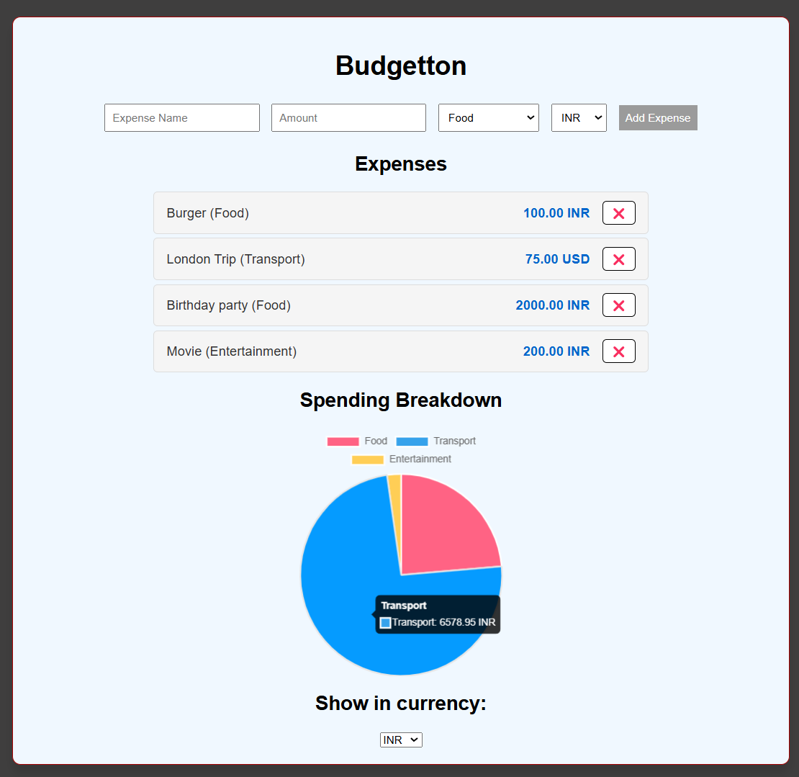

# Budgetton

Budgetton is a simple web application to track your expenses and visualize your spending breakdown. It allows you to add expenses, categorize them, and view a pie chart of your spending. Additionally, it supports multiple currencies and can convert expenses to a selected currency using real-time exchange rates.

## Features

- **Add Expenses**: Add expenses with a name, amount, category, and currency.
- **Expense List**: View a list of all added expenses.
- **Delete Expenses**: Remove expenses from the list.
- **Spending Breakdown**: Visualize your spending breakdown by category using a pie chart.
- **Currency Conversion**: Convert expenses to a selected currency using real-time exchange rates.
- **Local Storage**: Persist expenses data in the browser's local storage.

## APIs Integrated

- **Exchange Rate API**: Fetches real-time exchange rates to convert expenses to different currencies. The app uses the [ExchangeRate-API](https://www.exchangerate-api.com/) to get the latest exchange rates.
- **LocalStorage**: Stores expenses data in the LocalStorage which allows the data to be fetched from the device's browser to be used again in another session.
- **Chart.js**: Renders chart for data visualisation of different categories of expenditure done.

## How to Use

1. **Add an Expense**:
    - Enter the expense name.
    - Enter the amount.
    - Select a category from the dropdown.
    - Select a currency from the dropdown.
    - Click the "Add Expense" button.

2. **View Expenses**:
    - The added expenses will be listed under the "Expenses" section.
    - Each expense shows the name, category, amount, and currency.
    - Click the ❌ button to delete an expense.

3. **View Spending Breakdown**:
    - The pie chart under the "Spending Breakdown" section shows the distribution of expenses by category.

4. **Convert Currency**:
    - Select a currency from the "Show in currency" dropdown.
    - The expenses and the pie chart will be updated to reflect the selected currency.

## Project Structure

- `index.html`: The main HTML file containing the structure of the web app.
- `styles.css`: The CSS file for styling the web app.
- `script.js`: The JavaScript file containing the logic for adding expenses, rendering the expense list, updating the pie chart, and handling currency conversion.

## Setup

1. Clone the repository or download the source code.
2. Open `index.html` in a web browser to use the app.

## Dependencies

- **Chart.js**: A JavaScript library for creating charts. Used to create the pie chart for spending breakdown.
- **ExchangeRate-API**: An API to fetch real-time exchange rates for currency conversion.

## Screenshots

## License

This project is licensed under the MIT License.
